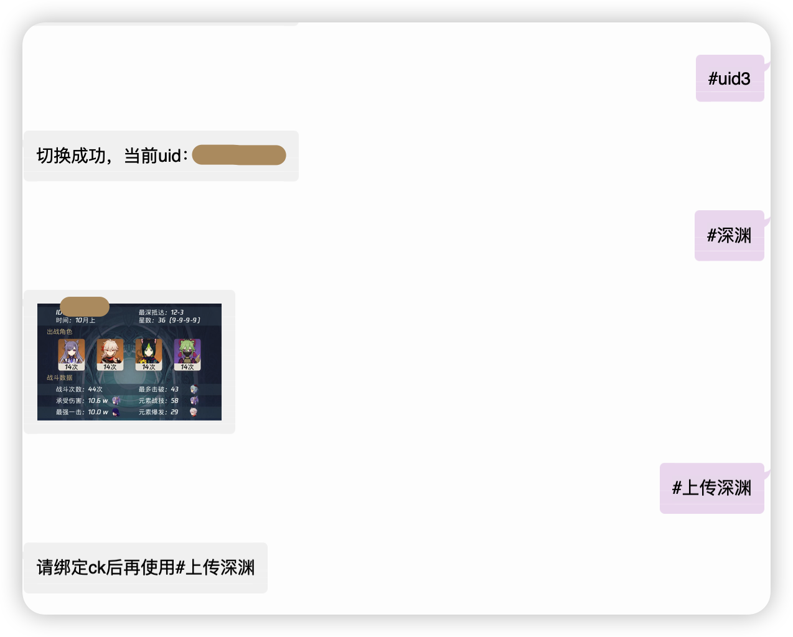

# 机器人常见问题

> 一切问题，请先发送 `#帮助`，认真查看是否有指令可以解决。
>
> 大部分问题都可以通过查看菜单解决
>
> 目前的帮助指令：`#帮助`，`#图鉴帮助`


[toc]


## 1.体力，cookie

> Bug确实是有，所以如果隔段时间就要绑定，属于正常。
>
> 绝大部分问题，可能是cookie失效，因为不失效的话，复制上一次的cookie再发一次，就能继续使用。

### 如何检测`cookie`有效，而不是掉绑了？

- 1.直接复制上次的cookie再次发送。
- 2.发送`#原石`，如果不能返回原石数量，就是cookie失效了，需要重新获取。


### 解决办法：如何重新获取cookie？

```shell
- 1.在群内发送#删除ck

- 2.登录米游社网页版

- 3.退出登录
- 3.一定要退出登录
- 3.一定要退出登录！（一定要退出，不退出的话，cookie不变）

- 4.重新登录，并获取cookie，发送机器人
# 注意新获取的cookie是否和过去相同，如果相同的话，即使机器人反馈绑定成功，也是无效的。
```


## 2. 面板问题

每次在游戏内切换角色或者圣遗物之后，都需要再次发送`#更新面板`，才会获取最新数据。

请确认想查看的角色，在当前的八个角色展示位。

`#更新面板`冷却时间5分钟，请耐心等待。


## 3.签到问题

签到随缘，目前无解，如果不想错过米游社奖励，请每日自行签到。


## 4.上传深渊失败

> `#上传深渊`和`#深渊`是两种指令,`#深渊`能用不代表`#上传深渊`有用。
>
> 如果`#上传深渊`无效，请重新获取cookie。
>
> 另外深渊是从米游社读取数据，米游社更新基本上机器人就会更新。

示例：



基本上是cookie失效了，或者cookie不全。

### 解决办法

同cookie失效解决办法，见👆上面[如何重新获取cookie？](### 解决办法：如何重新获取cookie？)


## 5.抽卡记录帮助

备注：ios暂时无法获取。

解决办法：根据机器人提示用其他方式进行获取，或者使用wx：提瓦特小助手。


## 6.AI绘图问题

此插件bug有点多，且用且珍惜，如果机器人不理你可能是cd，或者后面添加的参数格式错误，或者。。。出bug了。


## 最后再次提醒，有问题请先发送`#帮助`查看是否有自己需要的功能。